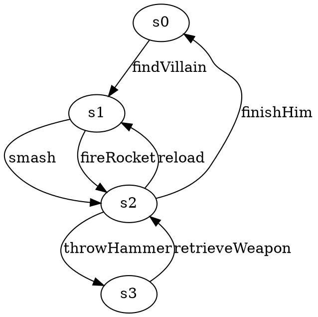
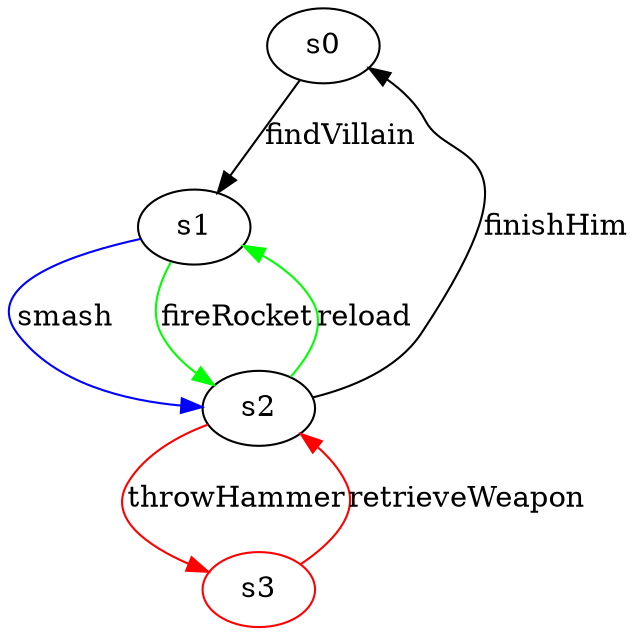

# GraphML Models Analysis.

#### You:
I'll give you three variants of a graphml model... here is the first one: <?xml version="1.0" encoding="UTF-8"?>
<graphml xmlns="http://graphml.graphdrawing.org/xmlns"  
    xmlns:xsi="http://www.w3.org/2001/XMLSchema-instance"
    xsi:schemaLocation="http://graphml.graphdrawing.org/xmlns
     http://graphml.graphdrawing.org/xmlns/1.0/graphml.xsd">
     <key attr.name="nodeLabel" attr.type="string" for="node" id="nodeLabel"/>
     <key attr.name="edgeLabel" attr.type="string" for="edge" id="edgeLabel"/>
  <graph id="G" edgedefault="directed">
    <node id="s0">
    	<data key="nodeLabel">s0</data>
    </node>
    <node id="s1">
    	<data key="nodeLabel">s1</data>
    </node>
    <node id="s2">
    	<data key="nodeLabel">s2</data>
    </node>
    <edge source="s0" target="s1">
    	<data key="edgeLabel">findVillain</data>
    </edge>
    <edge source="s1" target="s2">
    	<data key="edgeLabel">smash</data>
    </edge>
    <edge source="s2" target="s0">
    	<data key="edgeLabel">finishHim</data>
    </edge>
  </graph>
</graphml>

#### ChatGPT:
This is the first variant of a GraphML model. GraphML is an XML-based file format used for representing graphs. In this variant, you have:

1. A GraphML file with a namespace and schema location specified.
2. Two keys defined for nodes and edges, specifying their labels as strings.
3. A directed graph with an ID of "G".
4. Three nodes with IDs "s0", "s1", and "s2", and their respective labels.
5. Three edges connecting the nodes in the following order:
   - "s0" to "s1" with a label "findVillain"
   - "s1" to "s2" with a label "smash"
   - "s2" to "s0" with a label "finishHim"

Please provide the other two variants you want me to analyze.


#### You:
here is a second variant: <?xml version="1.0" encoding="UTF-8"?>
<graphml xmlns="http://graphml.graphdrawing.org/xmlns"  
    xmlns:xsi="http://www.w3.org/2001/XMLSchema-instance"
    xsi:schemaLocation="http://graphml.graphdrawing.org/xmlns
     http://graphml.graphdrawing.org/xmlns/1.0/graphml.xsd">
     <key attr.name="nodeLabel" attr.type="string" for="node" id="nodeLabel"/>
     <key attr.name="edgeLabel" attr.type="string" for="edge" id="edgeLabel"/>
  <graph id="G" edgedefault="directed">
    <node id="s0">
    	<data key="nodeLabel">s0</data>
    </node>
    <node id="s1">
    	<data key="nodeLabel">s1</data>
    </node>
    <node id="s2">
    	<data key="nodeLabel">s2</data>
    </node>
    <edge source="s0" target="s1">
    	<data key="edgeLabel">findVillain</data>
    </edge>
    <edge source="s1" target="s2">
    	<data key="edgeLabel">fireRocket</data>
    </edge>
    <edge source="s2" target="s1">
    	<data key="edgeLabel">reload</data>
    </edge>
    <edge source="s2" target="s0">
    	<data key="edgeLabel">finishHim</data>
    </edge>
  </graph>
</graphml>

#### ChatGPT:
This is the second variant of a GraphML model. Similar to the first variant, you have:

1. A GraphML file with a namespace and schema location specified.
2. Two keys defined for nodes and edges, specifying their labels as strings.
3. A directed graph with an ID of "G".
4. Three nodes with IDs "s0", "s1", and "s2", and their respective labels.
5. Four edges connecting the nodes in the following order:
   - "s0" to "s1" with a label "findVillain"
   - "s1" to "s2" with a label "fireRocket"
   - "s2" to "s1" with a label "reload"
   - "s2" to "s0" with a label "finishHim"

The main difference between the first and the second variant is the presence of an additional edge in the second variant that connects node "s2" back to node "s1" with a label "reload". Also, the label for the edge between "s1" and "s2" has changed from "smash" in the first variant to "fireRocket" in the second variant.

Please provide the third variant you want me to analyze.


#### You:
here is the third variant: <?xml version="1.0" encoding="UTF-8"?>
<graphml xmlns="http://graphml.graphdrawing.org/xmlns"  
    xmlns:xsi="http://www.w3.org/2001/XMLSchema-instance"
    xsi:schemaLocation="http://graphml.graphdrawing.org/xmlns
     http://graphml.graphdrawing.org/xmlns/1.0/graphml.xsd">
     <key attr.name="nodeLabel" attr.type="string" for="node" id="nodeLabel"/>
     <key attr.name="edgeLabel" attr.type="string" for="edge" id="edgeLabel"/>
  <graph id="G" edgedefault="directed">
    <node id="s0">
    	<data key="nodeLabel">s0</data>
    </node>
    <node id="s1">
    	<data key="nodeLabel">s1</data>
    </node>
    <node id="s2">
    	<data key="nodeLabel">s2</data>
    </node>
    <node id="s3">
    	<data key="nodeLabel">s3</data>
    </node>
    <edge source="s0" target="s1">
    	<data key="edgeLabel">findVillain</data>
    </edge>
    <edge source="s2" target="s3">
    	<data key="edgeLabel">throwHammer</data>
    </edge>
    <edge source="s1" target="s2">
    	<data key="edgeLabel">smash</data>
    </edge>
    <edge source="s3" target="s2">
    	<data key="edgeLabel">retrieveWeapon</data>
    </edge>
    <edge source="s2" target="s0">
    	<data key="edgeLabel">finishHim</data>
    </edge>
  </graph>
</graphml>

#### ChatGPT:
This is the third variant of a GraphML model. Similar to the first and second variants, you have:

1. A GraphML file with a namespace and schema location specified.
2. Two keys defined for nodes and edges, specifying their labels as strings.
3. A directed graph with an ID of "G".
4. Four nodes with IDs "s0", "s1", "s2", and "s3", and their respective labels.
5. Five edges connecting the nodes in the following order:
   - "s0" to "s1" with a label "findVillain"
   - "s1" to "s2" with a label "smash"
   - "s2" to "s3" with a label "throwHammer"
   - "s3" to "s2" with a label "retrieveWeapon"
   - "s2" to "s0" with a label "finishHim"

The main differences between the third variant and the other two are:

1. The third variant has an additional node "s3" with a label "s3".
2. The third variant introduces two new edges with labels "throwHammer" and "retrieveWeapon".
3. The third variant does not have the edges with labels "fireRocket" and "reload" present in the second variant.

The third variant represents a different graph structure as compared to the first two variants.


#### You:
can you synthesize a comparison table of the three variants?

#### ChatGPT:
Sure, here's a comparison table of the three variants:

| Feature              | Variant 1          | Variant 2          | Variant 3             |
| -------------------- | ------------------ | ------------------ | --------------------- |
| Number of nodes      | 3                  | 3                  | 4                     |
| Nodes (ID and label) | s0, s1, s2         | s0, s1, s2         | s0, s1, s2, s3        |
| Number of edges      | 3                  | 4                  | 5                     |
| Edges and labels     | s0-s1: findVillain | s0-s1: findVillain | s0-s1: findVillain    |
|                      | s1-s2: smash       | s1-s2: fireRocket  | s1-s2: smash          |
|                      | s2-s0: finishHim   | s2-s1: reload      | s2-s3: throwHammer    |
|                      |                    | s2-s0: finishHim   | s3-s2: retrieveWeapon |
|                      |                    |                    | s2-s0: finishHim      |
| Unique edge labels   | findVillain,       | findVillain,       | findVillain,          |
|                      | smash,             | fireRocket,        | smash,                |
|                      | finishHim          | reload,            | throwHammer,          |
|                      |                    | finishHim          | retrieveWeapon,       |
|                      |                    |                    | finishHim             |

This table compares the number of nodes and edges, the specific nodes and edges with their labels, and the unique edge labels present in each of the three GraphML variants.


#### You:
considering the three variants, can you summarize: (1) what's common (2) what varies?

#### ChatGPT:
Sure! Here's a summary of what's common and what varies among the three GraphML variants:

1. Common features:
   - All three variants are in the GraphML format with the same namespace and schema location.
   - Each variant defines two keys for nodes and edges, specifying their labels as strings.
   - All three variants have a directed graph with an ID of "G".
   - Nodes "s0", "s1", and "s2" with their respective labels are present in all three variants.
   - The edges "s0" to "s1" with the label "findVillain" and "s2" to "s0" with the label "finishHim" are present in all three variants.

2. Features that vary:
   - The number of nodes: Variant 1 and 2 have 3 nodes, while Variant 3 has 4 nodes.
   - The number of edges: Variant 1 has 3 edges, Variant 2 has 4 edges, and Variant 3 has 5 edges.
   - Unique edge labels and connections:
     - Variant 1: "s1" to "s2" with the label "smash".
     - Variant 2: "s1" to "s2" with the label "fireRocket" and "s2" to "s1" with the label "reload".
     - Variant 3: "s1" to "s2" with the label "smash", "s2" to "s3" with the label "throwHammer", and "s3" to "s2" with the label "retrieveWeapon".
   - The presence of node "s3" in Variant 3, which is not found in Variants 1 and 2.
   - Different graph structures resulting from the varying connections and labels among the edges in each variant.


#### You:
how would you call the features of variant 1, variant 2, and variant 3?

#### ChatGPT:
Here's a brief description of the features for each variant:

1. Variant 1 - "Smash Cycle":
   - This variant has a cyclic graph with three nodes and three edges.
   - The graph represents a cycle of actions: finding a villain, smashing, and finishing him.
   - The edge labels indicate a simple sequence of events, making it a straightforward graph.

2. Variant 2 - "Rocket Reload Loop":
   - This variant has three nodes and four edges, forming a loop between nodes "s1" and "s2".
   - The graph represents a cycle of actions: finding a villain, firing a rocket, reloading, and finishing him.
   - The presence of the "reload" edge between "s2" and "s1" indicates a loop of actions, where the firing and reloading of rockets can occur multiple times before finishing the villain.

3. Variant 3 - "Weapon Retrieval":
   - This variant has four nodes and five edges, with a more complex graph structure compared to the previous variants.
   - The graph represents a series of actions: finding a villain, smashing, throwing a hammer, retrieving the weapon, and finishing him.
   - The inclusion of node "s3" and the corresponding edges adds an additional step in the process, where a weapon is thrown and then retrieved before the villain is finished.


#### You:
can you create an integrated model that would represent the three variants? I'd like to have the result in graphml as well

#### ChatGPT:
Here's an integrated GraphML model that represents all three variants:

```xml
<?xml version="1.0" encoding="UTF-8"?>
<graphml xmlns="http://graphml.graphdrawing.org/xmlns"  
    xmlns:xsi="http://www.w3.org/2001/XMLSchema-instance"
    xsi:schemaLocation="http://graphml.graphdrawing.org/xmlns
     http://graphml.graphdrawing.org/xmlns/1.0/graphml.xsd">
     <key attr.name="nodeLabel" attr.type="string" for="node" id="nodeLabel"/>
     <key attr.name="edgeLabel" attr.type="string" for="edge" id="edgeLabel"/>
  <graph id="G" edgedefault="directed">
    <node id="s0">
        <data key="nodeLabel">s0</data>
    </node>
    <node id="s1">
        <data key="nodeLabel">s1</data>
    </node>
    <node id="s2">
        <data key="nodeLabel">s2</data>
    </node>
    <node id="s3">
        <data key="nodeLabel">s3</data>
    </node>
    <edge source="s0" target="s1">
        <data key="edgeLabel">findVillain</data>
    </edge>
    <edge source="s1" target="s2">
        <data key="edgeLabel">smash</data>
    </edge>
    <edge source="s1" target="s2">
        <data key="edgeLabel">fireRocket</data>
    </edge>
    <edge source="s2" target="s1">
        <data key="edgeLabel">reload</data>
    </edge>
    <edge source="s2" target="s3">
        <data key="edgeLabel">throwHammer</data>
    </edge>
    <edge source="s3" target="s2">
        <data key="edgeLabel">retrieveWeapon</data>
    </edge>
    <edge source="s2" target="s0">
        <data key="edgeLabel">finishHim</data>
    </edge>
  </graph>
</graphml>
```

This integrated model includes all nodes and edges from the three variants. It has four nodes ("s0", "s1", "s2", and "s3") and six edges. It combines the actions from all three variants, allowing for smashing, firing rockets, reloading, throwing a hammer, and retrieving the weapon in the same graph.


#### You:
can you translate it to dot format?

#### ChatGPT:
Certainly! Here's the integrated model translated into the DOT format:



This DOT representation maintains the same graph structure as the integrated GraphML model, including all nodes and edges with their respective labels.


#### You:
can you add color to edges to nodes that are specific to variant 1, variant 2, or variant 3? Says variant 1 is blue color, variant 2 is green color, variant 3 is red color, and if it's common to all variants, it remains black

#### ChatGPT:
Sure! Here's the integrated model in DOT format with colors added to edges and nodes specific to each variant:



In this DOT representation:

- Edges specific to Variant 1 are colored blue.
- Edges specific to Variant 2 are colored green.
- Edges specific to Variant 3 are colored red.
- Common edges and nodes have no specific color attribute and will be displayed in black by default.
