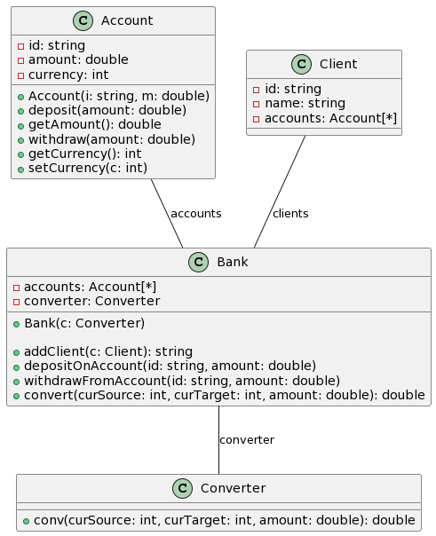
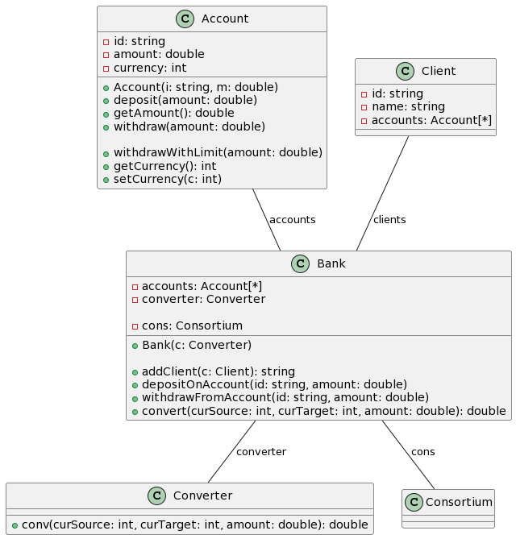
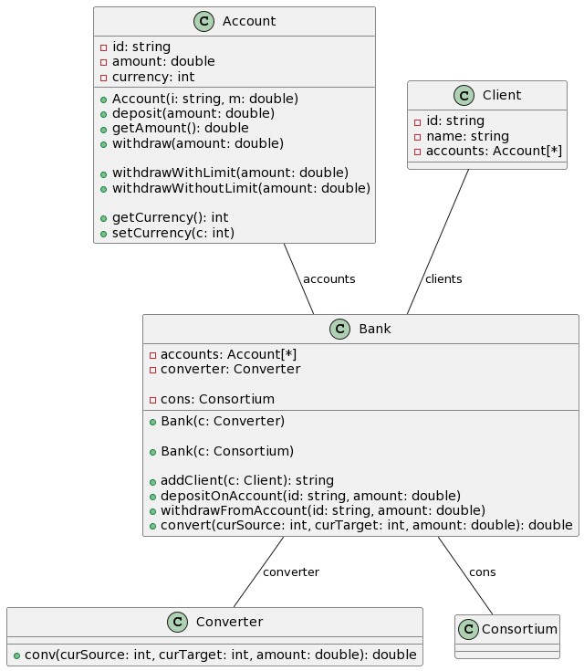

# Generative AI for Reengineering Variants into Software Product Lines

Given a set of variants, how to synthesize a program that can be configured to retrieve original variants?
For instance, given the three following UML variants: 

    
    
    

what is the integrated UML model, together with features' annotations, that can be used to retrieve them? 
The problem applies to any artefact (variants of Java code or projects, variants of graph models, etc.) 

This repository is a supporting material for "Generative AI for Reengineering Variants into Software Product Lines: An Experience Report" accepted at VariVolution SPLC 2023, Mathieu Acher and Jabier Martinez 
We revisit some of the cases considered by [https://github.com/but4reuse/but4reuse/wiki/Examples](BUT4Reuse), this time with generative AI (here: ChatGPT-4).

We consider five cases:
 * Java variants
 * UML variants
 * state chart variants
 * state machine variants 
 * PNG image variants

For each case, we share a directory (eg `uml`) with:
 * sessions (including replications with same or variants of prompts)
 * artefacts of the variants (Java, UML, GraphML, SCM, PNG)
 * synthesized code (Python generator and templates, DOT files, etc.)
