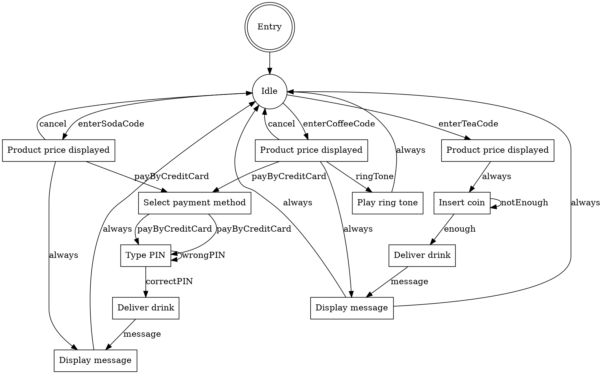
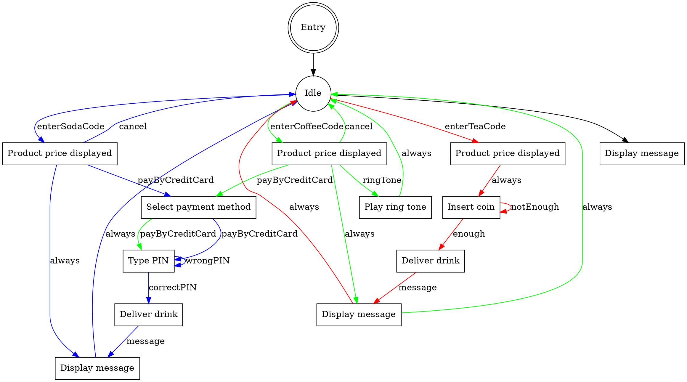
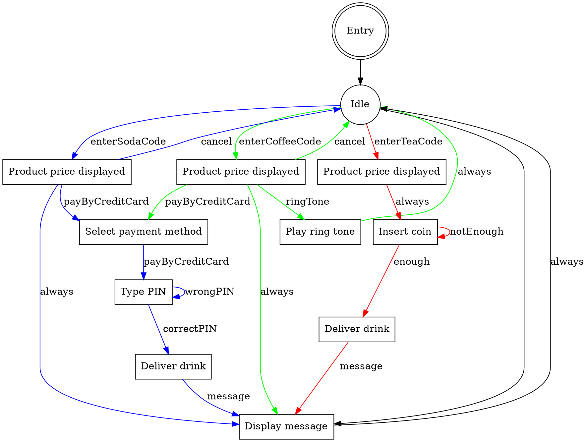

# Statechart Variants Comparison.

#### You:
I have three variants of a statechart, written hereafter, and respectively named Variant1, Variant2, Variant3. 
I'm separating each variant description with ===

===
The first variant, called Variant1, is as follows:
<sgraph:Statechart xmi:id="_9wZaYH9lEeO38f7pJZDqVw" specification="interface:&#xD;&#xA;in event enterSodaCode&#xD;&#xA;in event cancel&#xD;&#xA;in event payByCreditCard&#xD;&#xA;in event wrongPIN&#xD;&#xA;in event correctPIN&#xD;&#xA;in event message" name="vendingMachine">
    <regions xmi:id="_9we58H9lEeO38f7pJZDqVw" name="main region">
      <vertices xsi:type="sgraph:Entry" xmi:id="_9wjycX9lEeO38f7pJZDqVw">
        <outgoingTransitions xmi:id="_9wmOsX9lEeO38f7pJZDqVw" target="_9wkZh39lEeO38f7pJZDqVw"/>
      </vertices>
      <vertices xsi:type="sgraph:State" xmi:id="_9wkZh39lEeO38f7pJZDqVw" name="Idle" incomingTransitions="_9wmOsX9lEeO38f7pJZDqVw _vjy8UH9mEeO38f7pJZDqVw _hSsYwH9nEeO38f7pJZDqVw">
        <outgoingTransitions xmi:id="_1fZioH9nEeO38f7pJZDqVw" specification="enterSodaCode" target="_JSFU4H9mEeO38f7pJZDqVw"/>
      </vertices>
      <vertices xsi:type="sgraph:State" xmi:id="_JSFU4H9mEeO38f7pJZDqVw" name="Product price displayed" incomingTransitions="_1fZioH9nEeO38f7pJZDqVw">
        <outgoingTransitions xmi:id="_mLbCQH9nEeO38f7pJZDqVw" specification="always&#xD;&#xA;" target="_iENxwH9mEeO38f7pJZDqVw"/>
        <outgoingTransitions xmi:id="_vjy8UH9mEeO38f7pJZDqVw" specification="cancel" target="_9wkZh39lEeO38f7pJZDqVw"/>
      </vertices>
      <vertices xsi:type="sgraph:State" xmi:id="_O6DC8H9mEeO38f7pJZDqVw" name="Deliver drink" incomingTransitions="_E8fYMH9nEeO38f7pJZDqVw">
        <outgoingTransitions xmi:id="_3KPJQH9mEeO38f7pJZDqVw" specification="message" target="_VTgfYH9mEeO38f7pJZDqVw"/>
      </vertices>
      <vertices xsi:type="sgraph:State" xmi:id="_VTgfYH9mEeO38f7pJZDqVw" name="Display message" incomingTransitions="_3KPJQH9mEeO38f7pJZDqVw">
        <outgoingTransitions xmi:id="_hSsYwH9nEeO38f7pJZDqVw" specification="always" target="_9wkZh39lEeO38f7pJZDqVw"/>
      </vertices>
      <vertices xsi:type="sgraph:State" xmi:id="_iENxwH9mEeO38f7pJZDqVw" name="Select payment method" incomingTransitions="_mLbCQH9nEeO38f7pJZDqVw">
        <outgoingTransitions xmi:id="_SaKeQH9nEeO38f7pJZDqVw" specification="payByCreditCard" target="_BI5KwH9nEeO38f7pJZDqVw"/>
      </vertices>
      <vertices xsi:type="sgraph:State" xmi:id="_BI5KwH9nEeO38f7pJZDqVw" name="Type PIN" incomingTransitions="_CtwPwH9nEeO38f7pJZDqVw _SaKeQH9nEeO38f7pJZDqVw">
        <outgoingTransitions xmi:id="_CtwPwH9nEeO38f7pJZDqVw" specification="wrongPIN" target="_BI5KwH9nEeO38f7pJZDqVw"/>
        <outgoingTransitions xmi:id="_E8fYMH9nEeO38f7pJZDqVw" specification="correctPIN" target="_O6DC8H9mEeO38f7pJZDqVw"/>
      </vertices>
    </regions>
  </sgraph:Statechart>

===
The second variant, called Variant2, is as follows:
<sgraph:Statechart xmi:id="_9wZaYH9lEeO38f7pJZDqVw" specification="interface:&#xD;&#xA;in event enterCoffeeCode&#xD;&#xA;in event enterTeaCode&#xD;&#xA;in event cancel&#xD;&#xA;in event payByCreditCard&#xD;&#xA;in event wrongPIN&#xD;&#xA;in event correctPIN&#xD;&#xA;in event ringTone&#xD;&#xA;in event message&#xD;&#xA;" name="vendingMachine">
    <regions xmi:id="_9we58H9lEeO38f7pJZDqVw" name="main region">
      <vertices xsi:type="sgraph:Entry" xmi:id="_9wjycX9lEeO38f7pJZDqVw">
        <outgoingTransitions xmi:id="_9wmOsX9lEeO38f7pJZDqVw" target="_9wkZh39lEeO38f7pJZDqVw"/>
      </vertices>
      <vertices xsi:type="sgraph:State" xmi:id="_9wkZh39lEeO38f7pJZDqVw" name="Idle" incomingTransitions="_9wmOsX9lEeO38f7pJZDqVw _vjy8UH9mEeO38f7pJZDqVw _hSsYwH9nEeO38f7pJZDqVw _jRQXMH9nEeO38f7pJZDqVw">
        <outgoingTransitions xmi:id="_yX0tsH9nEeO38f7pJZDqVw" specification="enterCoffeeCode" target="_JSFU4H9mEeO38f7pJZDqVw"/>
        <outgoingTransitions xmi:id="_0CaAMH9nEeO38f7pJZDqVw" specification="enterTeaCode" target="_JSFU4H9mEeO38f7pJZDqVw"/>
      </vertices>
      <vertices xsi:type="sgraph:State" xmi:id="_JSFU4H9mEeO38f7pJZDqVw" name="Product price displayed" incomingTransitions="_yX0tsH9nEeO38f7pJZDqVw _0CaAMH9nEeO38f7pJZDqVw">
        <outgoingTransitions xmi:id="_mLbCQH9nEeO38f7pJZDqVw" specification="always&#xD;&#xA;" target="_iENxwH9mEeO38f7pJZDqVw"/>
        <outgoingTransitions xmi:id="_vjy8UH9mEeO38f7pJZDqVw" specification="cancel" target="_9wkZh39lEeO38f7pJZDqVw"/>
      </vertices>
      <vertices xsi:type="sgraph:State" xmi:id="_O6DC8H9mEeO38f7pJZDqVw" name="Deliver drink" incomingTransitions="_E8fYMH9nEeO38f7pJZDqVw">
        <outgoingTransitions xmi:id="_0GymYH9mEeO38f7pJZDqVw" specification="ringTone" target="_WG3O8H9mEeO38f7pJZDqVw"/>
        <outgoingTransitions xmi:id="_3KPJQH9mEeO38f7pJZDqVw" specification="message" target="_VTgfYH9mEeO38f7pJZDqVw"/>
      </vertices>
      <vertices xsi:type="sgraph:State" xmi:id="_VTgfYH9mEeO38f7pJZDqVw" name="Display message" incomingTransitions="_3KPJQH9mEeO38f7pJZDqVw">
        <outgoingTransitions xmi:id="_hSsYwH9nEeO38f7pJZDqVw" specification="always" target="_9wkZh39lEeO38f7pJZDqVw"/>
      </vertices>
      <vertices xsi:type="sgraph:State" xmi:id="_WG3O8H9mEeO38f7pJZDqVw" name="Play ring tone" incomingTransitions="_0GymYH9mEeO38f7pJZDqVw">
        <outgoingTransitions xmi:id="_jRQXMH9nEeO38f7pJZDqVw" specification="always" target="_9wkZh39lEeO38f7pJZDqVw"/>
      </vertices>
      <vertices xsi:type="sgraph:State" xmi:id="_iENxwH9mEeO38f7pJZDqVw" name="Select payment method" incomingTransitions="_mLbCQH9nEeO38f7pJZDqVw">
        <outgoingTransitions xmi:id="_SaKeQH9nEeO38f7pJZDqVw" specification="payByCreditCard" target="_BI5KwH9nEeO38f7pJZDqVw"/>
      </vertices>
      <vertices xsi:type="sgraph:State" xmi:id="_BI5KwH9nEeO38f7pJZDqVw" name="Type PIN" incomingTransitions="_CtwPwH9nEeO38f7pJZDqVw _SaKeQH9nEeO38f7pJZDqVw">
        <outgoingTransitions xmi:id="_CtwPwH9nEeO38f7pJZDqVw" specification="wrongPIN" target="_BI5KwH9nEeO38f7pJZDqVw"/>
        <outgoingTransitions xmi:id="_E8fYMH9nEeO38f7pJZDqVw" specification="correctPIN" target="_O6DC8H9mEeO38f7pJZDqVw"/>
      </vertices>
    </regions>
  </sgraph:Statechart>

===
The third variant, called Variant3, is as follows:
<sgraph:Statechart xmi:id="_9wZaYH9lEeO38f7pJZDqVw" specification="interface:&#xD;&#xA;in event enterTeaCode&#xD;&#xA;in event cancel&#xD;&#xA;in event payByCash&#xD;&#xA;in event notEnough&#xD;&#xA;in event enough&#xD;&#xA;in event message&#xD;&#xA;" name="vendingMachine">
    <regions xmi:id="_9we58H9lEeO38f7pJZDqVw" name="main region">
      <vertices xsi:type="sgraph:Entry" xmi:id="_9wjycX9lEeO38f7pJZDqVw">
        <outgoingTransitions xmi:id="_9wmOsX9lEeO38f7pJZDqVw" target="_9wkZh39lEeO38f7pJZDqVw"/>
      </vertices>
      <vertices xsi:type="sgraph:State" xmi:id="_9wkZh39lEeO38f7pJZDqVw" name="Idle" incomingTransitions="_9wmOsX9lEeO38f7pJZDqVw _vjy8UH9mEeO38f7pJZDqVw _hSsYwH9nEeO38f7pJZDqVw">
        <outgoingTransitions xmi:id="_0CaAMH9nEeO38f7pJZDqVw" specification="enterTeaCode" target="_JSFU4H9mEeO38f7pJZDqVw"/>
      </vertices>
      <vertices xsi:type="sgraph:State" xmi:id="_JSFU4H9mEeO38f7pJZDqVw" name="Product price displayed" incomingTransitions="_0CaAMH9nEeO38f7pJZDqVw">
        <outgoingTransitions xmi:id="_mLbCQH9nEeO38f7pJZDqVw" specification="always&#xD;&#xA;" target="_iENxwH9mEeO38f7pJZDqVw"/>
        <outgoingTransitions xmi:id="_vjy8UH9mEeO38f7pJZDqVw" specification="cancel" target="_9wkZh39lEeO38f7pJZDqVw"/>
      </vertices>
      <vertices xsi:type="sgraph:State" xmi:id="_N0GHgH9mEeO38f7pJZDqVw" name="Insert coin" incomingTransitions="_6imzQH9mEeO38f7pJZDqVw _WbzuwH9nEeO38f7pJZDqVw">
        <outgoingTransitions xmi:id="_6imzQH9mEeO38f7pJZDqVw" specification="notEnough" target="_N0GHgH9mEeO38f7pJZDqVw"/>
        <outgoingTransitions xmi:id="_jUgqEH9oEeO38f7pJZDqVw" specification="enough" target="_O6DC8H9mEeO38f7pJZDqVw"/>
      </vertices>
      <vertices xsi:type="sgraph:State" xmi:id="_O6DC8H9mEeO38f7pJZDqVw" name="Deliver drink" incomingTransitions="_jUgqEH9oEeO38f7pJZDqVw">
        <outgoingTransitions xmi:id="_3KPJQH9mEeO38f7pJZDqVw" specification="message" target="_VTgfYH9mEeO38f7pJZDqVw"/>
      </vertices>
      <vertices xsi:type="sgraph:State" xmi:id="_VTgfYH9mEeO38f7pJZDqVw" name="Display message" incomingTransitions="_3KPJQH9mEeO38f7pJZDqVw">
        <outgoingTransitions xmi:id="_hSsYwH9nEeO38f7pJZDqVw" specification="always" target="_9wkZh39lEeO38f7pJZDqVw"/>
      </vertices>
      <vertices xsi:type="sgraph:State" xmi:id="_iENxwH9mEeO38f7pJZDqVw" name="Select payment method" incomingTransitions="_mLbCQH9nEeO38f7pJZDqVw">
        <outgoingTransitions xmi:id="_WbzuwH9nEeO38f7pJZDqVw" specification="payByCash" target="_N0GHgH9mEeO38f7pJZDqVw"/>
      </vertices>
    </regions>
  </sgraph:Statechart>

Can you summarize what varies and what is common among the three variants?

#### ChatGPT:
Here's a summary of the variations and common elements among the three variants:

Common Elements:

- All three variants represent a statechart for a vending machine.
- Each variant has a main region that contains the states and transitions.
- The main region has an initial entry point (xsi:type="sgraph:Entry") that serves as the starting point for the statechart.
- The main region also has an Idle state that appears in all three variants.
- The Idle state has incoming transitions from various events and outgoing transitions to different states.

Variations:

Variant1:

- Events: enterSodaCode, cancel, payByCreditCard, wrongPIN, correctPIN, message
- States: Product price displayed, Deliver drink, Display message, Select payment method, Type PIN
- Transitions: enterSodaCode, cancel, payByCreditCard, wrongPIN, correctPIN, message

Variant2:

- Events: enterCoffeeCode, enterTeaCode, cancel, payByCreditCard, wrongPIN, correctPIN, ringTone, message
- States: Product price displayed, Deliver drink, Display message, Play ring tone, Select payment method, Type PIN
- Transitions: enterCoffeeCode, enterTeaCode, cancel, payByCreditCard, wrongPIN, correctPIN, ringTone, message

Variant3:

- Events: enterTeaCode, cancel, payByCash, notEnough, enough, message
- States: Product price displayed, Insert coin, Deliver drink, Display message, Select payment method
- Transitions: enterTeaCode, cancel, payByCash, notEnough, enough, message

In summary, the common elements across all three variants include the overall structure of the statechart, the main region, and the Idle state. The variations primarily occur in the events, additional states, and transitions specific to each variant.

#### You:
Can you create an integrated model that would represent the three variants? I'd like to have the result in DOT...

#### ChatGPT:
Certainly! Here's an integrated model that represents the three variants combined, represented in the DOT language:

You can save the above DOT representation to a file with a `.dot` extension and use a tool like Graphviz to generate the visual representation of the integrated model.

#### You:
Can you also add color to edges to nodes that are specific to Variant1, Variant2, or Variant3? Says Variant1 is blue color, Variant2 is green color, Variant3 is red color, and if it's common to all variants, it remains black

#### ChatGPT:
Certainly! Here's an updated DOT representation that includes color-coded edges based on the variants:

Save the updated DOT representation to a file with a `.dot` extension and use a tool like Graphviz to generate the visual representation of the integrated model with color-coded edges. The edges specific to Variant1 will be blue, Variant2 will be green, Variant3 will be red, and the edges common to all variants will remain black.

#### You:
great! can you merge nodes with same names?

#### ChatGPT:
Certainly! Here's an updated DOT representation that merges nodes with the same names:

In this updated representation, the nodes with the same names have been merged, simplifying the graph. Save the updated DOT representation to a file with a `.dot` extension and use a tool like Graphviz to generate the visual representation of the integrated model with merged nodes.
