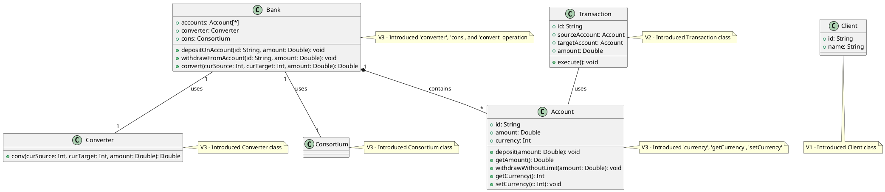

# UML Model for Bank

#### You:
I'll give you three variants of an UML model. 

The first variant, denoted Variant1, is: 

<?xml version="1.0" encoding="UTF-8"?>
<uml:Model xmi:version="20110701" xmlns:xmi="http://www.omg.org/spec/XMI/20110701" xmlns:uml="http://www.eclipse.org/uml2/4.0.0/UML" xmi:id="_HJ0ewHxvEeOpP-PjhVelzQ" name="Bank">
  <packagedElement xmi:type="uml:Package" xmi:id="_lZw_cHyAEeOS74OIN395aA" name="bs">
    <packagedElement xmi:type="uml:Class" xmi:id="_qv-PIHyAEeOS74OIN395aA" name="Account">
      <ownedAttribute xmi:id="_-xI3YHyAEeOS74OIN395aA" name="id" type="__EEsKn-OEeO47f7pJZDqVw"/>
      <ownedAttribute xmi:id="_D1m20HyBEeOS74OIN395aA" name="amount" type="__EEsJH-OEeO41f7pJZDqVw"/>
      <ownedAttribute xmi:id="_ZPoIYHyBEeOS74OIN395aA" name="limit" type="__EEsJH-OEeO41f7pJZDqVw"/>
      <ownedOperation xmi:id="_idK2AHyBEeOS74OIN395aA" name="Account">
        <ownedParameter xmi:id="_lkF1UH-PEeO38f7pJZDqVw" name="i" type="__EEsKn-OEeO47f7pJZDqVw"/>
        <ownedParameter xmi:id="_m38C0H-PEeO38f7pJZDqVw" name="m" type="__EEsJH-OEeO41f7pJZDqVw"/>
      </ownedOperation>
      <ownedOperation xmi:id="_zkKWsHyCEeOS74OIN395aA" name="deposit">
        <ownedParameter xmi:id="_vMbokH-PEeO38f7pJZDqVw" name="amount" type="__EEsJH-OEeO41f7pJZDqVw"/>
      </ownedOperation>
      <ownedOperation xmi:id="_12jQEHyCEeOS74OIN395aA" name="getAmount">
        <ownedParameter xmi:id="_iG78gH-QEeO38f7pJZDqVw" type="__EEsJH-OEeO41f7pJZDqVw" direction="return"/>
      </ownedOperation>
      <ownedOperation xmi:id="_3-WDAHyCEeOS74OIN395aA" name="withdrawWithLimit">
        <ownedParameter xmi:id="_6y11kH-QEeO38f7pJZDqVw" name="amount" type="__EEsJH-OEeO41f7pJZDqVw"/>
      </ownedOperation>
      <ownedOperation xmi:id="_5-ze4HyCEeOS74OIN395aA" name="getLimit">
        <ownedParameter xmi:id="_DVBSAH-REeO38f7pJZDqVw" name="" type="__EEsJH-OEeO41f7pJZDqVw" direction="return"/>
      </ownedOperation>
      <ownedOperation xmi:id="_9133EHyCEeOS74OIN395aA" name="setLimit">
        <ownedParameter xmi:id="_NrUXcH-REeO38f7pJZDqVw" name="l" type="__EEsJH-OEeO41f7pJZDqVw"/>
      </ownedOperation>
    </packagedElement>
    <packagedElement xmi:type="uml:Class" xmi:id="_tzN9sHyAEeOS74OIN395aA" name="Bank">
      <ownedAttribute xmi:id="_IYwnAHyDEeOS74OIN395aA" name="accounts" type="_qv-PIHyAEeOS74OIN395aA">
        <lowerValue xmi:type="uml:LiteralInteger" xmi:id="_N4Sx0HyDEeOS74OIN395aA"/>
        <upperValue xmi:type="uml:LiteralUnlimitedNatural" xmi:id="_NV7EkHyDEeOS74OIN395aA" value="*"/>
      </ownedAttribute>
      <ownedAttribute xmi:id="_QSzsMH-TEeO38f7pJZDqVw" name="cons" type="_Asxn8H-SEeO38f7pJZDqVw"/>
      <ownedOperation xmi:id="_aWleQH-TEeO38f7pJZDqVw" name="Bank">
        <ownedParameter xmi:id="_dTdfEH-TEeO38f7pJZDqVw" name="c" type="_Asxn8H-SEeO38f7pJZDqVw"/>
      </ownedOperation>
      <ownedOperation xmi:id="_bPQy8HyDEeOS74OIN395aA" name="depositOnAccount">
        <ownedParameter xmi:id="_i7L8kH-TEeO38f7pJZDqVw" name="id" type="__EEsKn-OEeO47f7pJZDqVw"/>
        <ownedParameter xmi:id="_mMsJkH-TEeO38f7pJZDqVw" name="amount" type="__EEsJH-OEeO41f7pJZDqVw"/>
      </ownedOperation>
      <ownedOperation xmi:id="_e0EWcHyDEeOS74OIN395aA" name="withdrawFromAccount">
        <ownedParameter xmi:id="_H61pwH-VEeO38f7pJZDqVw" name="id" type="__EEsKn-OEeO47f7pJZDqVw"/>
        <ownedParameter xmi:id="_LrnMsH-VEeO38f7pJZDqVw" name="amount" type="__EEsJH-OEeO41f7pJZDqVw"/>
      </ownedOperation>
    </packagedElement>
    <packagedElement xmi:type="uml:Class" xmi:id="_wODBYHyAEeOS74OIN395aA" name="Client">
      <ownedAttribute xmi:id="_r0NL8HyDEeOS74OIN395aA" name="id" type="__EEsKn-OEeO47f7pJZDqVw"/>
      <ownedAttribute xmi:id="_tlfjYHyDEeOS74OIN395aA" name="name" type="__EEsKn-OEeO47f7pJZDqVw"/>
    </packagedElement>
    <packagedElement xmi:type="uml:Class" xmi:id="_Asxn8H-SEeO38f7pJZDqVw" name="Consortium"/>
  </packagedElement>
  <packagedElement xmi:type="uml:Package" xmi:id="__EEsIH-OEeO37f7pJZDqVw" name="Common Java datatypes">
    <packagedElement xmi:type="uml:PrimitiveType" xmi:id="__EEsIX-OEeO38f7pJZDqVw" name="int"/>
    <packagedElement xmi:type="uml:PrimitiveType" xmi:id="__EEsIn-OEeO39f7pJZDqVw" name="long"/>
    <packagedElement xmi:type="uml:PrimitiveType" xmi:id="__EEsI3-OEeO40f7pJZDqVw" name="float"/>
    <packagedElement xmi:type="uml:PrimitiveType" xmi:id="__EEsJH-OEeO41f7pJZDqVw" name="double"/>
    <packagedElement xmi:type="uml:PrimitiveType" xmi:id="__EEsJX-OEeO42f7pJZDqVw" name="boolean"/>
    <packagedElement xmi:type="uml:PrimitiveType" xmi:id="__EEsJn-OEeO43f7pJZDqVw" name="void"/>
    <packagedElement xmi:type="uml:PrimitiveType" xmi:id="__EEsJ3-OEeO44f7pJZDqVw" name="char"/>
    <packagedElement xmi:type="uml:PrimitiveType" xmi:id="__EEsKH-OEeO45f7pJZDqVw" name="short"/>
    <packagedElement xmi:type="uml:PrimitiveType" xmi:id="__EEsKX-OEeO46f7pJZDqVw" name="byte"/>
    <packagedElement xmi:type="uml:PrimitiveType" xmi:id="__EEsKn-OEeO47f7pJZDqVw" name="string"/>
  </packagedElement>
</uml:Model>

#### ChatGPT:
This UML model (Variant1) represents a bank system containing four main classes: "Account", "Bank", "Client", and "Consortium". These classes are described as follows:

1. The "Account" class has three attributes: "id" (String), "amount" (double), and "limit" (double). The class has several methods including a constructor (denoted by the class name), "deposit", "getAmount", "withdrawWithLimit", "getLimit", and "setLimit". The methods have parameters which are the types defined in the "Common Java datatypes" package.

2. The "Bank" class has two attributes: "accounts" (type: Account) and "cons" (type: Consortium). The multiplicity of the "accounts" attribute is set to unlimited meaning a bank can have zero to any number of accounts. This class also includes a constructor and methods: "depositOnAccount" and "withdrawFromAccount".

3. The "Client" class has two attributes: "id" (string) and "name" (string). There are no defined operations (methods) for this class in this UML model.

4. The "Consortium" class doesn't have any attributes or methods defined.

Lastly, there's a package named "Common Java datatypes" which defines primitive Java types such as int, long, float, double, boolean, void, char, short, byte, and string. These types are used as types for the class attributes and method parameters.

#### You:
The second UML variant, denoted Variant2, is: 

<?xml version="1.0" encoding="UTF-8"?>
<uml:Model xmi:version="20110701" xmlns:xmi="http://www.omg.org/spec/XMI/20110701" xmlns:uml="http://www.eclipse.org/uml2/4.0.0/UML" xmi:id="_HJ0ewHxvEeOpP-PjhVelzQ" name="Bank">
  <packagedElement xmi:type="uml:Package" xmi:id="_lZw_cHyAEeOS74OIN395aA" name="bs">
    <packagedElement xmi:type="uml:Class" xmi:id="_qv-PIHyAEeOS74OIN395aA" name="Account">
      <ownedAttribute xmi:id="_-xI3YHyAEeOS74OIN395aA" name="id" type="__EEsKn-OEeO47f7pJZDqVw"/>
      <ownedAttribute xmi:id="_D1m20HyBEeOS74OIN395aA" name="amount" type="__EEsJH-OEeO41f7pJZDqVw"/>
      <ownedAttribute xmi:id="_ZPoIYHyBEeOS74OIN395aA" name="limit" type="__EEsJH-OEeO41f7pJZDqVw"/>
      <ownedAttribute xmi:id="_dViN0HyBEeOS74OIN395aA" name="currency" type="__EEsIX-OEeO38f7pJZDqVw"/>
      <ownedOperation xmi:id="_idK2AHyBEeOS74OIN395aA" name="Account">
        <ownedParameter xmi:id="_lkF1UH-PEeO38f7pJZDqVw" name="i" type="__EEsKn-OEeO47f7pJZDqVw"/>
        <ownedParameter xmi:id="_m38C0H-PEeO38f7pJZDqVw" name="m" type="__EEsJH-OEeO41f7pJZDqVw"/>
      </ownedOperation>
      <ownedOperation xmi:id="_zkKWsHyCEeOS74OIN395aA" name="deposit">
        <ownedParameter xmi:id="_vMbokH-PEeO38f7pJZDqVw" name="amount" type="__EEsJH-OEeO41f7pJZDqVw"/>
      </ownedOperation>
      <ownedOperation xmi:id="_12jQEHyCEeOS74OIN395aA" name="getAmount">
        <ownedParameter xmi:id="_iG78gH-QEeO38f7pJZDqVw" type="__EEsJH-OEeO41f7pJZDqVw" direction="return"/>
      </ownedOperation>
      <ownedOperation xmi:id="_3-WDAHyCEeOS74OIN395aA" name="withdrawWithLimit">
        <ownedParameter xmi:id="_6y11kH-QEeO38f7pJZDqVw" name="amount" type="__EEsJH-OEeO41f7pJZDqVw"/>
      </ownedOperation>
      <ownedOperation xmi:id="_5-ze4HyCEeOS74OIN395aA" name="getLimit">
        <ownedParameter xmi:id="_DVBSAH-REeO38f7pJZDqVw" name="" type="__EEsJH-OEeO41f7pJZDqVw" direction="return"/>
      </ownedOperation>
      <ownedOperation xmi:id="_9133EHyCEeOS74OIN395aA" name="setLimit">
        <ownedParameter xmi:id="_NrUXcH-REeO38f7pJZDqVw" name="l" type="__EEsJH-OEeO41f7pJZDqVw"/>
      </ownedOperation>
      <ownedOperation xmi:id="__AU4AHyCEeOS74OIN395aA" name="getCurrency">
        <ownedParameter xmi:id="_SbhXEH-REeO38f7pJZDqVw" type="__EEsIX-OEeO38f7pJZDqVw" direction="return"/>
      </ownedOperation>
      <ownedOperation xmi:id="_BqYqgHyDEeOS74OIN395aA" name="setCurrency">
        <ownedParameter xmi:id="_qKRrYH-REeO38f7pJZDqVw" name="c" type="__EEsIX-OEeO38f7pJZDqVw"/>
      </ownedOperation>
    </packagedElement>
    <packagedElement xmi:type="uml:Class" xmi:id="_tzN9sHyAEeOS74OIN395aA" name="Bank">
      <ownedAttribute xmi:id="_IYwnAHyDEeOS74OIN395aA" name="accounts" type="_qv-PIHyAEeOS74OIN395aA">
        <lowerValue xmi:type="uml:LiteralInteger" xmi:id="_N4Sx0HyDEeOS74OIN395aA"/>
        <upperValue xmi:type="uml:LiteralUnlimitedNatural" xmi:id="_NV7EkHyDEeOS74OIN395aA" value="*"/>
      </ownedAttribute>
      <ownedAttribute xmi:id="_RY7nAHyDEeOS74OIN395aA" name="converter">
        <lowerValue xmi:type="uml:LiteralInteger" xmi:id="_UmVXIHyDEeOS74OIN395aA"/>
      </ownedAttribute>
      <ownedOperation xmi:id="_i_aVgHyDEeOS74OIN395aA" name="Bank">
        <ownedParameter xmi:id="_WQa6IH-TEeO38f7pJZDqVw" name="c" type="_4TmzQHyAEeOS74OIN395aA"/>
      </ownedOperation>
      <ownedOperation xmi:id="_bPQy8HyDEeOS74OIN395aA" name="depositOnAccount">
        <ownedParameter xmi:id="_i7L8kH-TEeO38f7pJZDqVw" name="id" type="__EEsKn-OEeO47f7pJZDqVw"/>
        <ownedParameter xmi:id="_mMsJkH-TEeO38f7pJZDqVw" name="amount" type="__EEsJH-OEeO41f7pJZDqVw"/>
      </ownedOperation>
      <ownedOperation xmi:id="_e0EWcHyDEeOS74OIN395aA" name="withdrawFromAccount">
        <ownedParameter xmi:id="_H61pwH-VEeO38f7pJZDqVw" name="id" type="__EEsKn-OEeO47f7pJZDqVw"/>
        <ownedParameter xmi:id="_LrnMsH-VEeO38f7pJZDqVw" name="amount" type="__EEsJH-OEeO41f7pJZDqVw"/>
      </ownedOperation>
      <ownedOperation xmi:id="_lAQy8HyDEeOS74OIN395aA" name="convert">
        <ownedParameter xmi:id="_T2UkUH-VEeO38f7pJZDqVw" type="__EEsJH-OEeO41f7pJZDqVw" direction="return"/>
        <ownedParameter xmi:id="_WTOroH-VEeO38f7pJZDqVw" name="curSource" type="__EEsIX-OEeO38f7pJZDqVw"/>
        <ownedParameter xmi:id="_Y8sBMH-VEeO38f7pJZDqVw" name="curTarget" type="__EEsIX-OEeO38f7pJZDqVw"/>
        <ownedParameter xmi:id="_cJxBMH-VEeO38f7pJZDqVw" name="amount" type="__EEsJH-OEeO41f7pJZDqVw"/>
      </ownedOperation>
    </packagedElement>
    <packagedElement xmi:type="uml:Class" xmi:id="_wODBYHyAEeOS74OIN395aA" name="Client">
      <ownedAttribute xmi:id="_r0NL8HyDEeOS74OIN395aA" name="id" type="__EEsKn-OEeO47f7pJZDqVw"/>
      <ownedAttribute xmi:id="_tlfjYHyDEeOS74OIN395aA" name="name" type="__EEsKn-OEeO47f7pJZDqVw"/>
    </packagedElement>
    <packagedElement xmi:type="uml:Class" xmi:id="_4TmzQHyAEeOS74OIN395aA" name="Converter">
      <ownedOperation xmi:id="_y3jS4HyDEeOS74OIN395aA" name="conv">
        <ownedParameter xmi:id="_FlHTEH-WEeO38f7pJZDqVw" type="__EEsJH-OEeO41f7pJZDqVw" direction="return"/>
        <ownedParameter xmi:id="_Ju_5kH-WEeO38f7pJZDqVw" name="curSource" type="__EEsIX-OEeO38f7pJZDqVw"/>
        <ownedParameter xmi:id="_Mb4WkH-WEeO38f7pJZDqVw" name="curTarget" type="__EEsIX-OEeO38f7pJZDqVw"/>
        <ownedParameter xmi:id="_PS_GkH-WEeO38f7pJZDqVw" name="amount" type="__EEsJH-OEeO41f7pJZDqVw"/>
      </ownedOperation>
    </packagedElement>
  </packagedElement>
  <packagedElement xmi:type="uml:Package" xmi:id="__EEsIH-OEeO37f7pJZDqVw" name="Common Java datatypes">
    <packagedElement xmi:type="uml:PrimitiveType" xmi:id="__EEsIX-OEeO38f7pJZDqVw" name="int"/>
    <packagedElement xmi:type="uml:PrimitiveType" xmi:id="__EEsIn-OEeO39f7pJZDqVw" name="long"/>
    <packagedElement xmi:type="uml:PrimitiveType" xmi:id="__EEsI3-OEeO40f7pJZDqVw" name="float"/>
    <packagedElement xmi:type="uml:PrimitiveType" xmi:id="__EEsJH-OEeO41f7pJZDqVw" name="double"/>
    <packagedElement xmi:type="uml:PrimitiveType" xmi:id="__EEsJX-OEeO42f7pJZDqVw" name="boolean"/>
    <packagedElement xmi:type="uml:PrimitiveType" xmi:id="__EEsJn-OEeO43f7pJZDqVw" name="void"/>
    <packagedElement xmi:type="uml:PrimitiveType" xmi:id="__EEsJ3-OEeO44f7pJZDqVw" name="char"/>
    <packagedElement xmi:type="uml:PrimitiveType" xmi:id="__EEsKH-OEeO45f7pJZDqVw" name="short"/>
    <packagedElement xmi:type="uml:PrimitiveType" xmi:id="__EEsKX-OEeO46f7pJZDqVw" name="byte"/>
    <packagedElement xmi:type="uml:PrimitiveType" xmi:id="__EEsKn-OEeO47f7pJZDqVw" name="string"/>
  </packagedElement>
</uml:Model>

#### ChatGPT:
The UML represented in the XMI format you provided describes a model of a banking system. This model contains the following classes:

1. `Account` class - An account has the attributes `id`, `amount`, `limit`, and `currency`, each with their respective data types. It also has a number of operations, including `deposit`, `getAmount`, `withdrawWithLimit`, `getLimit`, `setLimit`, `getCurrency`, and `setCurrency`, each with their appropriate parameters.

2. `Bank` class - A bank has the attributes `accounts` and `converter`, and it supports operations such as `depositOnAccount`, `withdrawFromAccount`, and `convert`.

3. `Client` class - A client has attributes `id` and `name`.

4. `Converter` class - This class has an operation `conv` which seems to be used for currency conversion.

All these classes belong to the package `bs` which itself is within the model `Bank`. There's also another package `Common Java datatypes` that provides definitions of basic data types like `int`, `long`, `float`, `double`, `boolean`, `void`, `char`, `short`, `byte`, and `string`.

Please note that UML models like this are typically used for visualizing, specifying, constructing, and documenting the artifacts of a software system. They provide a standard way to visualize a system's architectural blueprints, including elements such as activities, actors, business processes, database schemas, components, and programming language statements.

#### You:
The third UML model variant, denoted Variant3, is: 

<?xml version="1.0" encoding="UTF-8"?>
<uml:Model xmi:version="20110701" xmlns:xmi="http://www.omg.org/spec/XMI/20110701" xmlns:uml="http://www.eclipse.org/uml2/4.0.0/UML" xmi:id="_HJ0ewHxvEeOpP-PjhVelzQ" name="Bank">
  <packagedElement xmi:type="uml:Package" xmi:id="_lZw_cHyAEeOS74OIN395aA" name="bs">
    <packagedElement xmi:type="uml:Class" xmi:id="_qv-PIHyAEeOS74OIN395aA" name="Account">
      <ownedAttribute xmi:id="_-xI3YHyAEeOS74OIN395aA" name="id" type="__EEsKn-OEeO47f7pJZDqVw"/>
      <ownedAttribute xmi:id="_D1m20HyBEeOS74OIN395aA" name="amount" type="__EEsJH-OEeO41f7pJZDqVw"/>
      <ownedAttribute xmi:id="_dViN0HyBEeOS74OIN395aA" name="currency" type="__EEsIX-OEeO38f7pJZDqVw"/>
      <ownedOperation xmi:id="_idK2AHyBEeOS74OIN395aA" name="Account">
        <ownedParameter xmi:id="_lkF1UH-PEeO38f7pJZDqVw" name="i" type="__EEsKn-OEeO47f7pJZDqVw"/>
        <ownedParameter xmi:id="_m38C0H-PEeO38f7pJZDqVw" name="m" type="__EEsJH-OEeO41f7pJZDqVw"/>
      </ownedOperation>
      <ownedOperation xmi:id="_zkKWsHyCEeOS74OIN395aA" name="deposit">
        <ownedParameter xmi:id="_vMbokH-PEeO38f7pJZDqVw" name="amount" type="__EEsJH-OEeO41f7pJZDqVw"/>
      </ownedOperation>
      <ownedOperation xmi:id="_12jQEHyCEeOS74OIN395aA" name="getAmount">
        <ownedParameter xmi:id="_iG78gH-QEeO38f7pJZDqVw" type="__EEsJH-OEeO41f7pJZDqVw" direction="return"/>
      </ownedOperation>
      <ownedOperation xmi:id="_3-WDAHyCEeOS74OIN395aA" name="withdrawWithoutLimit">
        <ownedParameter xmi:id="_6y11kH-QEeO38f7pJZDqVw" name="amount" type="__EEsJH-OEeO41f7pJZDqVw"/>
      </ownedOperation>
      <ownedOperation xmi:id="__AU4AHyCEeOS74OIN395aA" name="getCurrency">
        <ownedParameter xmi:id="_SbhXEH-REeO38f7pJZDqVw" type="__EEsIX-OEeO38f7pJZDqVw" direction="return"/>
      </ownedOperation>
      <ownedOperation xmi:id="_BqYqgHyDEeOS74OIN395aA" name="setCurrency">
        <ownedParameter xmi:id="_qKRrYH-REeO38f7pJZDqVw" name="c" type="__EEsIX-OEeO38f7pJZDqVw"/>
      </ownedOperation>
    </packagedElement>
    <packagedElement xmi:type="uml:Class" xmi:id="_tzN9sHyAEeOS74OIN395aA" name="Bank">
      <ownedAttribute xmi:id="_IYwnAHyDEeOS74OIN395aA" name="accounts" type="_qv-PIHyAEeOS74OIN395aA">
        <lowerValue xmi:type="uml:LiteralInteger" xmi:id="_N4Sx0HyDEeOS74OIN395aA"/>
        <upperValue xmi:type="uml:LiteralUnlimitedNatural" xmi:id="_NV7EkHyDEeOS74OIN395aA" value="*"/>
      </ownedAttribute>
      <ownedAttribute xmi:id="_RY7nAHyDEeOS74OIN395aA" name="converter">
        <lowerValue xmi:type="uml:LiteralInteger" xmi:id="_UmVXIHyDEeOS74OIN395aA"/>
      </ownedAttribute>
      <ownedAttribute xmi:id="_QSzsMH-TEeO38f7pJZDqVw" name="cons" type="_Asxn8H-SEeO38f7pJZDqVw"/>
      <ownedOperation xmi:id="_i_aVgHyDEeOS74OIN395aA" name="Bank">
        <ownedParameter xmi:id="_WQa6IH-TEeO38f7pJZDqVw" name="c" type="_4TmzQHyAEeOS74OIN395aA"/>
      </ownedOperation>
      <ownedOperation xmi:id="_aWleQH-TEeO38f7pJZDqVw" name="Bank">
        <ownedParameter xmi:id="_dTdfEH-TEeO38f7pJZDqVw" name="c" type="_Asxn8H-SEeO38f7pJZDqVw"/>
      </ownedOperation>
      <ownedOperation xmi:id="_bPQy8HyDEeOS74OIN395aA" name="depositOnAccount">
        <ownedParameter xmi:id="_i7L8kH-TEeO38f7pJZDqVw" name="id" type="__EEsKn-OEeO47f7pJZDqVw"/>
        <ownedParameter xmi:id="_mMsJkH-TEeO38f7pJZDqVw" name="amount" type="__EEsJH-OEeO41f7pJZDqVw"/>
      </ownedOperation>
      <ownedOperation xmi:id="_e0EWcHyDEeOS74OIN395aA" name="withdrawFromAccount">
        <ownedParameter xmi:id="_H61pwH-VEeO38f7pJZDqVw" name="id" type="__EEsKn-OEeO47f7pJZDqVw"/>
        <ownedParameter xmi:id="_LrnMsH-VEeO38f7pJZDqVw" name="amount" type="__EEsJH-OEeO41f7pJZDqVw"/>
      </ownedOperation>
      <ownedOperation xmi:id="_lAQy8HyDEeOS74OIN395aA" name="convert">
        <ownedParameter xmi:id="_T2UkUH-VEeO38f7pJZDqVw" type="__EEsJH-OEeO41f7pJZDqVw" direction="return"/>
        <ownedParameter xmi:id="_WTOroH-VEeO38f7pJZDqVw" name="curSource" type="__EEsIX-OEeO38f7pJZDqVw"/>
        <ownedParameter xmi:id="_Y8sBMH-VEeO38f7pJZDqVw" name="curTarget" type="__EEsIX-OEeO38f7pJZDqVw"/>
        <ownedParameter xmi:id="_cJxBMH-VEeO38f7pJZDqVw" name="amount" type="__EEsJH-OEeO41f7pJZDqVw"/>
      </ownedOperation>
    </packagedElement>
    <packagedElement xmi:type="uml:Class" xmi:id="_wODBYHyAEeOS74OIN395aA" name="Client">
      <ownedAttribute xmi:id="_r0NL8HyDEeOS74OIN395aA" name="id" type="__EEsKn-OEeO47f7pJZDqVw"/>
      <ownedAttribute xmi:id="_tlfjYHyDEeOS74OIN395aA" name="name" type="__EEsKn-OEeO47f7pJZDqVw"/>
    </packagedElement>
    <packagedElement xmi:type="uml:Class" xmi:id="_4TmzQHyAEeOS74OIN395aA" name="Converter">
      <ownedOperation xmi:id="_y3jS4HyDEeOS74OIN395aA" name="conv">
        <ownedParameter xmi:id="_FlHTEH-WEeO38f7pJZDqVw" type="__EEsJH-OEeO41f7pJZDqVw" direction="return"/>
        <ownedParameter xmi:id="_Ju_5kH-WEeO38f7pJZDqVw" name="curSource" type="__EEsIX-OEeO38f7pJZDqVw"/>
        <ownedParameter xmi:id="_Mb4WkH-WEeO38f7pJZDqVw" name="curTarget" type="__EEsIX-OEeO38f7pJZDqVw"/>
        <ownedParameter xmi:id="_PS_GkH-WEeO38f7pJZDqVw" name="amount" type="__EEsJH-OEeO41f7pJZDqVw"/>
      </ownedOperation>
    </packagedElement>
    <packagedElement xmi:type="uml:Class" xmi:id="_Asxn8H-SEeO38f7pJZDqVw" name="Consortium"/>
  </packagedElement>
  <packagedElement xmi:type="uml:Package" xmi:id="__EEsIH-OEeO37f7pJZDqVw" name="Common Java datatypes">
    <packagedElement xmi:type="uml:PrimitiveType" xmi:id="__EEsIX-OEeO38f7pJZDqVw" name="int"/>
    <packagedElement xmi:type="uml:PrimitiveType" xmi:id="__EEsIn-OEeO39f7pJZDqVw" name="long"/>
    <packagedElement xmi:type="uml:PrimitiveType" xmi:id="__EEsI3-OEeO40f7pJZDqVw" name="float"/>
    <packagedElement xmi:type="uml:PrimitiveType" xmi:id="__EEsJH-OEeO41f7pJZDqVw" name="double"/>
    <packagedElement xmi:type="uml:PrimitiveType" xmi:id="__EEsJX-OEeO42f7pJZDqVw" name="boolean"/>
    <packagedElement xmi:type="uml:PrimitiveType" xmi:id="__EEsJn-OEeO43f7pJZDqVw" name="void"/>
    <packagedElement xmi:type="uml:PrimitiveType" xmi:id="__EEsJ3-OEeO44f7pJZDqVw" name="char"/>
    <packagedElement xmi:type="uml:PrimitiveType" xmi:id="__EEsKH-OEeO45f7pJZDqVw" name="short"/>
    <packagedElement xmi:type="uml:PrimitiveType" xmi:id="__EEsKX-OEeO46f7pJZDqVw" name="byte"/>
    <packagedElement xmi:type="uml:PrimitiveType" xmi:id="__EEsKn-OEeO47f7pJZDqVw" name="string"/>
  </packagedElement>
</uml:Model>

#### ChatGPT:
This XML file represents a UML model which includes classes and attributes for a bank system. It is expressed in XMI (XML Metadata Interchange) format, which is a standard way of exchanging metadata information via XML.

Here are the main elements of this UML model:

1. **Bank**: This is the main class in this model. It contains several attributes including "accounts", "converter", and "cons", and several operations including "Bank", "depositOnAccount", "withdrawFromAccount", and "convert". The "accounts" attribute is a collection (with an unspecified upper limit) of the "Account" class.

2. **Account**: This class represents a bank account. It has attributes including "id", "amount", and "currency", and several operations like "Account", "deposit", "getAmount", "withdrawWithoutLimit", "getCurrency", and "setCurrency". These operations likely represent actions that can be performed on an account.

3. **Client**: This class represents a client of the bank. It has two attributes, "id" and "name".

4. **Converter**: This class seems to handle currency conversion, as suggested by the "conv" operation, which includes parameters "curSource", "curTarget", and "amount".

5. **Consortium**: This class doesn't have any attributes or operations. It might be a placeholder for future development or serve a purpose not immediately apparent from the given XML.

The model also includes a package for common Java datatypes, like "int", "long", "float", "double", "boolean", "void", "char", "short", "byte", and "string". These are used as types for the various attributes and operation parameters in the classes.

Please note, to fully understand the roles and behaviors of these classes, we would need more information, possibly including method implementations, class relationships, and so on. This file just provides the structural definition of the classes.

#### You:
Please create an integrated UML model representing the three variants in PlantUML format. 
I want to annotate the PlantUML model and the specific elements of the three variants... If a model element is included in all variants, no comment. If it is specific to at least one variant, write a comment with V1, V2, or V3

#### ChatGPT:
Certainly, here is an integrated UML model in PlantUML format representing the three variants. For simplicity, I will assume the three variants each have a `Bank`, `Account`, and `Client` class, with Variant 2 introducing a `Transaction` class and Variant 3 introducing a `Converter` and `Consortium` class.

Please replace the following pseudo code with the actual UML representation of your classes and their attributes or operations.

Please keep in mind that PlantUML does not natively support showing multiple class versions in a single diagram. The above PlantUML script uses notes to signify when a class or a class feature was introduced. Replace the actual attributes and operations for each class according to your system details.
