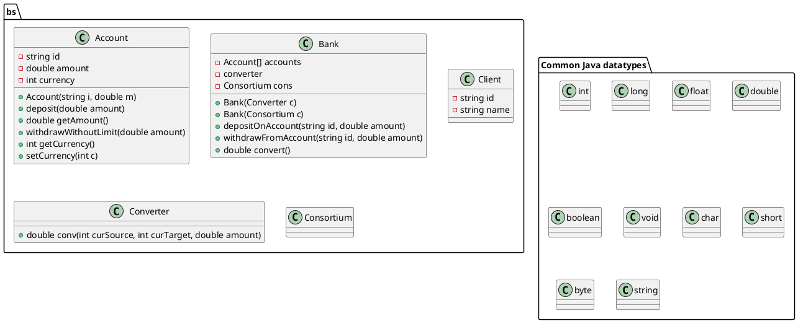

# UML Model to PlantUML

#### You:
here is a UML model:

<uml:Model xmi:version="20110701" xmlns:xmi="http://www.omg.org/spec/XMI/20110701" xmlns:uml="http://www.eclipse.org/uml2/4.0.0/UML" xmi:id="_HJ0ewHxvEeOpP-PjhVelzQ" name="Bank">
  <packagedElement xmi:type="uml:Package" xmi:id="_lZw_cHyAEeOS74OIN395aA" name="bs">
    <packagedElement xmi:type="uml:Class" xmi:id="_qv-PIHyAEeOS74OIN395aA" name="Account">
      <ownedAttribute xmi:id="_-xI3YHyAEeOS74OIN395aA" name="id" type="__EEsKn-OEeO47f7pJZDqVw"/>
      <ownedAttribute xmi:id="_D1m20HyBEeOS74OIN395aA" name="amount" type="__EEsJH-OEeO41f7pJZDqVw"/>
      <ownedAttribute xmi:id="_dViN0HyBEeOS74OIN395aA" name="currency" type="__EEsIX-OEeO38f7pJZDqVw"/>
      <ownedOperation xmi:id="_idK2AHyBEeOS74OIN395aA" name="Account">
        <ownedParameter xmi:id="_lkF1UH-PEeO38f7pJZDqVw" name="i" type="__EEsKn-OEeO47f7pJZDqVw"/>
        <ownedParameter xmi:id="_m38C0H-PEeO38f7pJZDqVw" name="m" type="__EEsJH-OEeO41f7pJZDqVw"/>
      </ownedOperation>
      <ownedOperation xmi:id="_zkKWsHyCEeOS74OIN395aA" name="deposit">
        <ownedParameter xmi:id="_vMbokH-PEeO38f7pJZDqVw" name="amount" type="__EEsJH-OEeO41f7pJZDqVw"/>
      </ownedOperation>
      <ownedOperation xmi:id="_12jQEHyCEeOS74OIN395aA" name="getAmount">
        <ownedParameter xmi:id="_iG78gH-QEeO38f7pJZDqVw" type="__EEsJH-OEeO41f7pJZDqVw" direction="return"/>
      </ownedOperation>
      <ownedOperation xmi:id="_3-WDAHyCEeOS74OIN395aA" name="withdrawWithoutLimit">
        <ownedParameter xmi:id="_6y11kH-QEeO38f7pJZDqVw" name="amount" type="__EEsJH-OEeO41f7pJZDqVw"/>
      </ownedOperation>
      <ownedOperation xmi:id="__AU4AHyCEeOS74OIN395aA" name="getCurrency">
        <ownedParameter xmi:id="_SbhXEH-REeO38f7pJZDqVw" type="__EEsIX-OEeO38f7pJZDqVw" direction="return"/>
      </ownedOperation>
      <ownedOperation xmi:id="_BqYqgHyDEeOS74OIN395aA" name="setCurrency">
        <ownedParameter xmi:id="_qKRrYH-REeO38f7pJZDqVw" name="c" type="__EEsIX-OEeO38f7pJZDqVw"/>
      </ownedOperation>
    </packagedElement>
    <packagedElement xmi:type="uml:Class" xmi:id="_tzN9sHyAEeOS74OIN395aA" name="Bank">
      <ownedAttribute xmi:id="_IYwnAHyDEeOS74OIN395aA" name="accounts" type="_qv-PIHyAEeOS74OIN395aA">
        <lowerValue xmi:type="uml:LiteralInteger" xmi:id="_N4Sx0HyDEeOS74OIN395aA"/>
        <upperValue xmi:type="uml:LiteralUnlimitedNatural" xmi:id="_NV7EkHyDEeOS74OIN395aA" value="*"/>
      </ownedAttribute>
      <ownedAttribute xmi:id="_RY7nAHyDEeOS74OIN395aA" name="converter">
        <lowerValue xmi:type="uml:LiteralInteger" xmi:id="_UmVXIHyDEeOS74OIN395aA"/>
      </ownedAttribute>
      <ownedAttribute xmi:id="_QSzsMH-TEeO38f7pJZDqVw" name="cons" type="_Asxn8H-SEeO38f7pJZDqVw"/>
      <ownedOperation xmi:id="_i_aVgHyDEeOS74OIN395aA" name="Bank">
        <ownedParameter xmi:id="_WQa6IH-TEeO38f7pJZDqVw" name="c" type="_4TmzQHyAEeOS74OIN395aA"/>
      </ownedOperation>
      <ownedOperation xmi:id="_aWleQH-TEeO38f7pJZDqVw" name="Bank">
        <ownedParameter xmi:id="_dTdfEH-TEeO38f7pJZDqVw" name="c" type="_Asxn8H-SEeO38f7pJZDqVw"/>
      </ownedOperation>
      <ownedOperation xmi:id="_bPQy8HyDEeOS74OIN395aA" name="depositOnAccount">
        <ownedParameter xmi:id="_i7L8kH-TEeO38f7pJZDqVw" name="id" type="__EEsKn-OEeO47f7pJZDqVw"/>
        <ownedParameter xmi:id="_mMsJkH-TEeO38f7pJZDqVw" name="amount" type="__EEsJH-OEeO41f7pJZDqVw"/>
      </ownedOperation>
      <ownedOperation xmi:id="_e0EWcHyDEeOS74OIN395aA" name="withdrawFromAccount">
        <ownedParameter xmi:id="_H61pwH-VEeO38f7pJZDqVw" name="id" type="__EEsKn-OEeO47f7pJZDqVw"/>
        <ownedParameter xmi:id="_LrnMsH-VEeO38f7pJZDqVw" name="amount" type="__EEsJH-OEeO41f7pJZDqVw"/>
      </ownedOperation>
      <ownedOperation xmi:id="_lAQy8HyDEeOS74OIN395aA" name="convert">
        <ownedParameter xmi:id="_T2UkUH-VEeO38f7pJZDqVw" type="__EEsJH-OEeO41f7pJZDqVw" direction="return"/>
        <ownedParameter xmi:id="_WTOroH-VEeO38f7pJZDqVw" name="curSource" type="__EEsIX-OEeO38f7pJZDqVw"/>
        <ownedParameter xmi:id="_Y8sBMH-VEeO38f7pJZDqVw" name="curTarget" type="__EEsIX-OEeO38f7pJZDqVw"/>
        <ownedParameter xmi:id="_cJxBMH-VEeO38f7pJZDqVw" name="amount" type="__EEsJH-OEeO41f7pJZDqVw"/>
      </ownedOperation>
    </packagedElement>
    <packagedElement xmi:type="uml:Class" xmi:id="_wODBYHyAEeOS74OIN395aA" name="Client">
      <ownedAttribute xmi:id="_r0NL8HyDEeOS74OIN395aA" name="id" type="__EEsKn-OEeO47f7pJZDqVw"/>
      <ownedAttribute xmi:id="_tlfjYHyDEeOS74OIN395aA" name="name" type="__EEsKn-OEeO47f7pJZDqVw"/>
    </packagedElement>
    <packagedElement xmi:type="uml:Class" xmi:id="_4TmzQHyAEeOS74OIN395aA" name="Converter">
      <ownedOperation xmi:id="_y3jS4HyDEeOS74OIN395aA" name="conv">
        <ownedParameter xmi:id="_FlHTEH-WEeO38f7pJZDqVw" type="__EEsJH-OEeO41f7pJZDqVw" direction="return"/>
        <ownedParameter xmi:id="_Ju_5kH-WEeO38f7pJZDqVw" name="curSource" type="__EEsIX-OEeO38f7pJZDqVw"/>
        <ownedParameter xmi:id="_Mb4WkH-WEeO38f7pJZDqVw" name="curTarget" type="__EEsIX-OEeO38f7pJZDqVw"/>
        <ownedParameter xmi:id="_PS_GkH-WEeO38f7pJZDqVw" name="amount" type="__EEsJH-OEeO41f7pJZDqVw"/>
      </ownedOperation>
    </packagedElement>
    <packagedElement xmi:type="uml:Class" xmi:id="_Asxn8H-SEeO38f7pJZDqVw" name="Consortium"/>
  </packagedElement>
  <packagedElement xmi:type="uml:Package" xmi:id="__EEsIH-OEeO37f7pJZDqVw" name="Common Java datatypes">
    <packagedElement xmi:type="uml:PrimitiveType" xmi:id="__EEsIX-OEeO38f7pJZDqVw" name="int"/>
    <packagedElement xmi:type="uml:PrimitiveType" xmi:id="__EEsIn-OEeO39f7pJZDqVw" name="long"/>
    <packagedElement xmi:type="uml:PrimitiveType" xmi:id="__EEsI3-OEeO40f7pJZDqVw" name="float"/>
    <packagedElement xmi:type="uml:PrimitiveType" xmi:id="__EEsJH-OEeO41f7pJZDqVw" name="double"/>
    <packagedElement xmi:type="uml:PrimitiveType" xmi:id="__EEsJX-OEeO42f7pJZDqVw" name="boolean"/>
    <packagedElement xmi:type="uml:PrimitiveType" xmi:id="__EEsJn-OEeO43f7pJZDqVw" name="void"/>
    <packagedElement xmi:type="uml:PrimitiveType" xmi:id="__EEsJ3-OEeO44f7pJZDqVw" name="char"/>
    <packagedElement xmi:type="uml:PrimitiveType" xmi:id="__EEsKH-OEeO45f7pJZDqVw" name="short"/>
    <packagedElement xmi:type="uml:PrimitiveType" xmi:id="__EEsKX-OEeO46f7pJZDqVw" name="byte"/>
    <packagedElement xmi:type="uml:PrimitiveType" xmi:id="__EEsKn-OEeO47f7pJZDqVw" name="string"/>
  </packagedElement>
</uml:Model>

can you translate to PlantUML?

#### ChatGPT:
Sure, here's the equivalent PlantUML class diagram:

Please note that some features in the UML model are not translated into PlantUML because PlantUML does not support them or because they were not explicitly defined in your UML model.

For instance, the `converter` attribute in the `Bank` class has no type specified in your UML model. Also, the `convert` operation in the `Bank` class has parameters but no names. Finally, the operations in the `Converter` and `Bank` classes have return types but PlantUML does not support explicit return type declaration.

The Java datatypes have been added as classes in their own package, but they are standard types that wouldn't normally be included in a class diagram.

In addition, the relationship between the classes are not described in the UML model. These could be associations, aggregations, compositions or inheritance. If you want to include these relationships, you would need to add them to your UML model. For example, if the Bank has a aggregation relationship with Account, in PlantUML you would add the line: `Bank "1" o-- "*" Account` inside the `bs` package.
